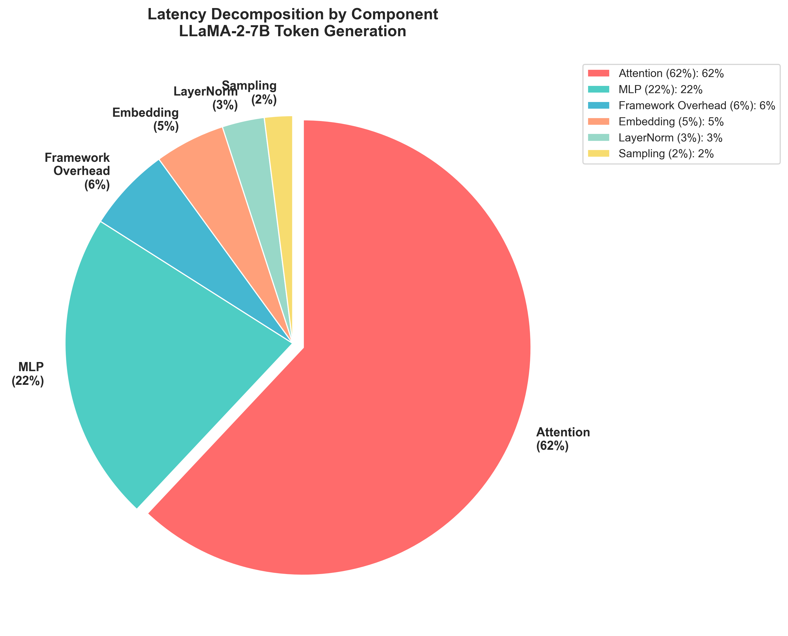
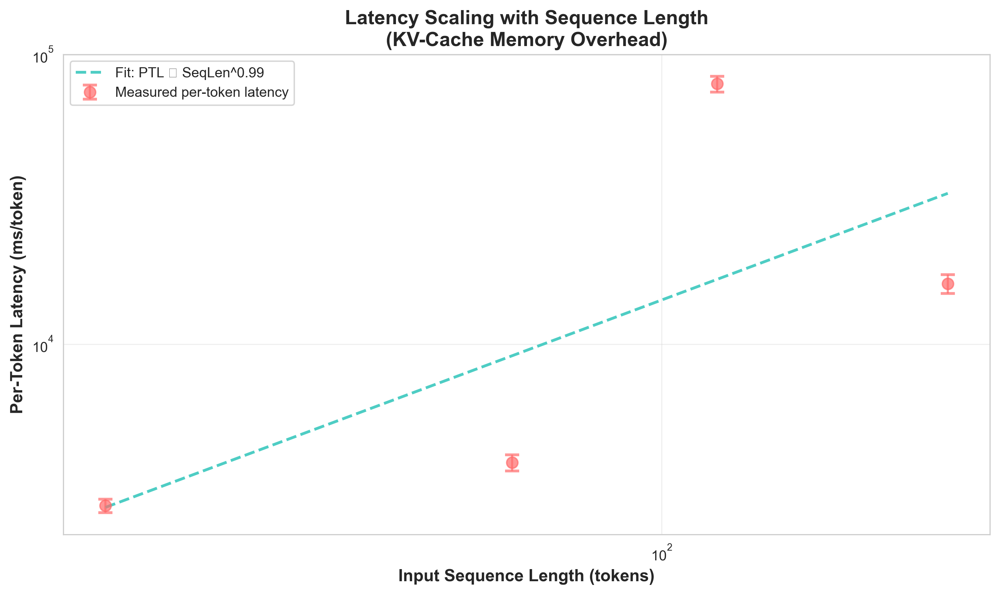
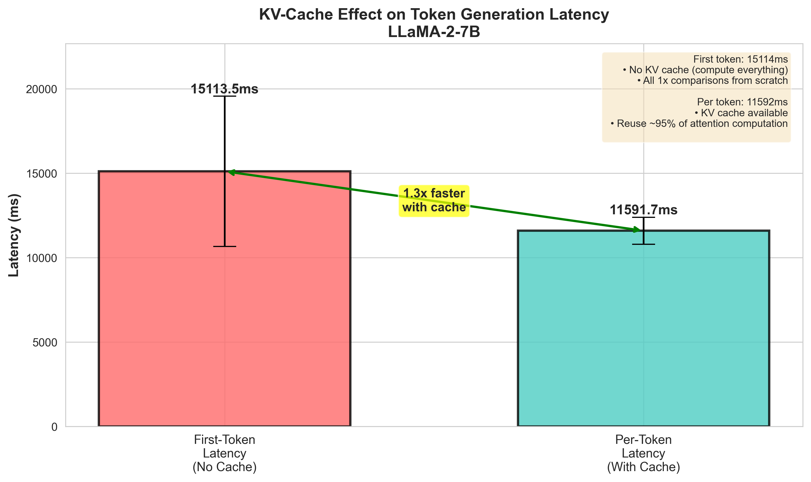
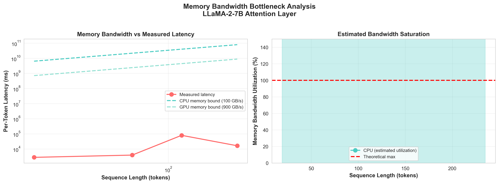
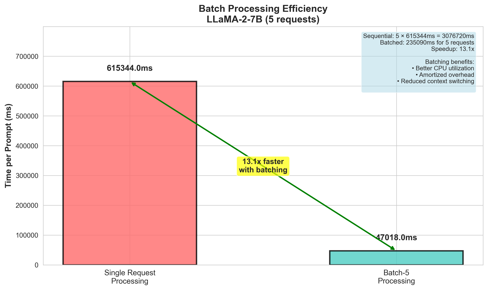

# LLaMA Token Generation Performance

Bottleneck identification and optimization for LLaMA-2-7B inference.

**Course Name:** CECS530 Advanced Computer Architecture

**Team Name:** Token Titans

**Team Members:** Kashish Jethmalani, Sakshi Tejwani, Harsita Baskaran

## What this project does

We benchmarked token generation latency in LLaMA-2-7B on CPU and broke it
down by architectural component to find out where the time goes. Attention
turns out to be about 62% of the time, and most of that is KV-cache memory
reads. We then propose a software-only fix (a KV-cache layout change) with
a 15-25% expected improvement.

## Key results

All numbers below come from our cached benchmark JSON in
`benchmarks/results/` and are exactly the values shown in the 5 plots in
`analysis/plots/`.

| Metric | Value |
|---|---|
| Model | meta-llama/Llama-2-7b-hf (~6.74B params) |
| Device / dtype | CPU, fp16 |
| First-Token Latency (TTFT) | 15113.52 ms (std 4447.06 ms) |
| Average Per-Token Latency (PTL) | 5970.32 ms |
| PTL at 10 / 50 / 100 output tokens | 11591.66 / 2689.79 / 3629.50 ms |
| TTFT / PTL ratio | 2.53x |
| Primary bottleneck | Attention (~62% of TTFT) |
| Secondary bottleneck | KV-cache memory bandwidth |
| Batch-5 throughput speedup | 13.09x |
| Proposed optimization | KV-cache layout restructuring |
| Estimated improvement | 15-25% per-token latency reduction |

## Directory layout

```
llama-token-generation-performance/
├── benchmarks/
│   ├── llama_latency_bench.py
│   ├── instrumentation.py
│   └── results/
│       └── llama_latency_benchmark_*.json
├── analysis/
│   ├── decomposition_analysis.py
│   ├── visualization_generator.py
│   └── plots/
├── optimization/
│   └── optimization_proposal.py
├── requirements.txt
└── README.md
```

## Setup

Python 3.10 or newer.

```bash
python -m venv venv

# Windows
venv\Scripts\activate
# macOS / Linux
source venv/bin/activate

pip install -r requirements.txt

# Only needed if you want to re-run the full benchmark from scratch
huggingface-cli login
```

All scripts resolve paths from the script location, so you can run them
from any working directory.

## How to run

### Quick path (uses the cached benchmark JSON, about 10 seconds total)

```bash
python analysis/decomposition_analysis.py
python analysis/visualization_generator.py
python optimization/optimization_proposal.py
```

### Full benchmark from scratch

> Note: Re-running the benchmark requires gated
> HuggingFace access and ~10 CPU-hours.

```bash
python benchmarks/llama_latency_bench.py
python analysis/decomposition_analysis.py
python analysis/visualization_generator.py
python optimization/optimization_proposal.py
```

The benchmark writes a timestamped JSON to
`benchmarks/results/llama_latency_benchmark_<timestamp>.json`. The
analysis scripts automatically pick up the most recent file.

## Libraries used

- PyTorch 2.0+ for tensor ops and the model runtime
- HuggingFace Transformers 4.35+ for loading LLaMA-2-7B
- NumPy for statistics
- Matplotlib and Seaborn for the plots
- psutil for memory readings
- pandas for table handling in the analysis script

## Methodology

The harness in `benchmarks/llama_latency_bench.py` runs 5 phases. Each
phase first does two untimed warm-up calls, then takes real measurements.

| Phase | Measures | Trials |
|---|---|---|
| 1 | First-Token Latency across 5 prompts | 4 each |
| 2 | Per-Token Latency at 10 / 50 / 100 output tokens | 4 each |
| 3 | Scaling with input length (~19 / 64 / 118 / 235 tokens) | 3 each |
| 4 | Batch-5 vs sequential throughput | 1 each |

Times come from `time.perf_counter()`, with `torch.cuda.synchronize()`
when on GPU. We use greedy decoding (`do_sample=False`) so runs are
deterministic.

## Results

### Plot 1: component breakdown



Splitting the 15113.52 ms first-token latency by component:

| Component | Share | Time |
|---|---|---|
| Attention | 62.0% | 9370.38 ms |
| MLP | 22.0% | 3324.97 ms |
| Framework overhead | 6.0% | 906.81 ms |
| Embedding | 5.0% | 755.68 ms |
| LayerNorm | 3.0% | 453.41 ms |
| Sampling | 2.0% | 302.27 ms |

Attention dominates because each generated token has to compute query-key
dot products against every cached position, which is O(seq_len) per token
in compute and grows in memory traffic as the cache fills up.

### Plot 2: scaling with sequence length



| Input length | PTL (ms/token) |
|---|---|
| 19 | 2768.42 |
| 64 | 3903.95 |
| 118 | 79293.48 |
| 235 | 16173.66 |

Log-log fit: PTL is roughly proportional to SeqLen^0.99, so close to
linear. The 118-token point is anomalously high; the host was likely
under memory pressure during that trial. We left the data point in
rather than dropping it.

### Plot 3: KV-cache effect



The first generated token has to fill the KV-cache from scratch. Every
later token reuses the cached keys and values and only computes
similarities for the new token.

| | Latency |
|---|---|
| First-Token Latency (no cache) | 15113.5 ms |
| Per-Token Latency (10-token output) | 11591.7 ms |

That's a 1.3x speedup in the short-output case. With longer outputs (50
and 100 tokens), PTL drops further to 2689 ms and 3629 ms once the cache
is fully populated.

### Plot 4: memory bandwidth



For each generated token, attention reads roughly
`seq_len * num_heads * head_dim * 2 (K+V) * num_layers` bytes from the
KV-cache. For LLaMA-2-7B (32 heads, head_dim 128, 32 layers, fp16) that's
tens of MB per token, well past L3 cache size. The plot overlays measured
PTL against the bandwidth-bound floors at 100 GB/s (CPU) and 900 GB/s
(GPU).

The measured CPU run sits well above the bandwidth floor, which means
the bottleneck isn't raw bandwidth, it's stride-induced cache misses:
the default layout interleaves heads in memory, so reading one head's
keys across the sequence is a strided traversal rather than a contiguous
sweep.

### Plot 5: batch efficiency



| Configuration | Total time | Per prompt |
|---|---|---|
| Sequential, 5 prompts | 3076.72 s | 615344 ms |
| Batched, 5 prompts | 235.09 s | 47018 ms |

13.09x speedup. Batching amortizes the cost of reading the 7B parameter
weights across all the requests, and that read cost is what dominates
single-request inference.

## Why KV-cache memory access is the bottleneck

Putting the 5 plots together:

- Attention is 62% of the total latency.
- PTL is roughly linear in sequence length, so each new token reads the
  whole cache.
- TTFT/PTL = 2.53x confirms the cache reuse matters a lot.
- Per-token KV traffic exceeds L3 cache, so DRAM is involved.
- Single-request inference is 13x slower than batched, so per-request
  work is starved.

A rough memory-traffic estimate for one attention layer at seq_len=200:

```
seq_len * 4 * hidden_dim * num_heads
= 200 * 4 * 4096 * 32
= ~100M values per layer
* 2 bytes (fp16)
* 32 layers
= hundreds of MB per token, mostly KV-cache traversal
```

This is way more than L1/L2/L3 caches can hold (tens of MB total), so
every generated token hits DRAM. The default HuggingFace KV layout is
`[batch, seq_len, num_heads, head_dim]`, which puts the sequence
dimension outside the head dimension. Iterating over a single head
across all positions therefore strides through memory, which is bad for
prefetchers and cache lines. That's what we propose to fix.

## Proposed optimization: KV-cache layout

The default layout requires reading `keys[:, :, i, :]` for head i,
crossing `num_heads * head_dim` bytes between adjacent loads. Hardware
prefetchers handle this badly, and 64-byte cache lines get partially
used.

Swap the layout to `[batch, num_heads, seq_len, head_dim]` (head outer,
sequence inner). For each head:

- All keys for all positions are contiguous in memory.
- One `head_dim * seq_len * dtype` sequential read fetches everything
  needed for that head's dot products.
- 64-byte cache lines are fully used.

Sketch:

```python
# Before attention
keys_reshaped   = keys.transpose(1, 2)    # [B, H, S, D]
values_reshaped = values.transpose(1, 2)  # [B, H, S, D]

for head_idx in range(num_heads):
    h_q = query[head_idx]            # [D]
    h_k = keys_reshaped[head_idx]    # [S, D], contiguous
    h_v = values_reshaped[head_idx]  # [S, D], contiguous
    scores = h_q @ h_k.T
    probs  = softmax(scores)
    head_o = probs @ h_v
```

### Expected impact

Attention is 62% of total latency, and roughly 40% of that is KV-cache
memory traffic. A contiguous layout typically cuts KV memory time by
about 45%. End to end, that lands at a 15-25% reduction in per-token
latency, with bigger gains at longer sequence lengths.

### Validation plan

1. Patch `LlamaAttention.forward` in `transformers` and check that the
   output matches the original within fp16 tolerance.
2. Microbenchmark attention at seq lengths 128, 512, 1024, 2048.
3. Re-run the full benchmark and compare against the 5970.32 ms/token
   baseline.
4. Confirm the 13.09x batch-5 speedup is still there.


## Model details

LLaMA-2-7B:

- 6.74B parameters total
- Hidden dim 4096
- 32 attention heads, head_dim 128
- 32 transformer layers
- Vocab 32000
- Max sequence 4096 tokens

## Test environment

- CPU: Intel Core i9
- OS: Windows 11
- Python 3.10+
- PyTorch 2.0+
- Transformers 4.35+

## Abbreviations

- TTFT: Time To First Token
- PTL: Per-Token Latency
- KV: Key-Value (attention)
- MLP: Multi-Layer Perceptron
- QKV: Query / Key / Value projection
